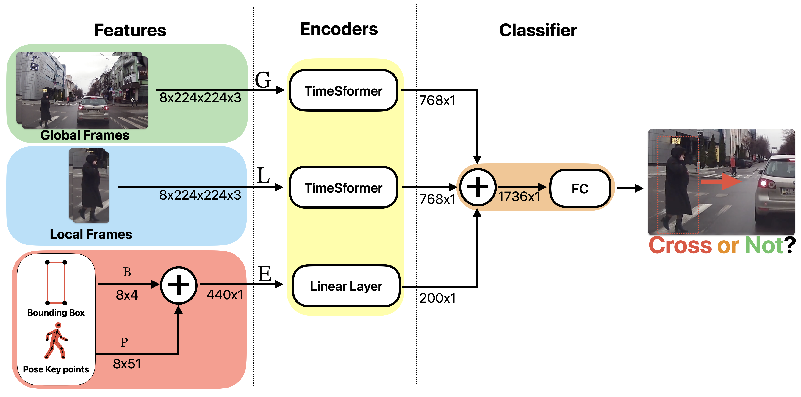

## Predicting pedestrian intention using multi-modal feature fusion

The codebase for this project is split into the following sections
- The top directory contains the **proposed_model** class, the **training_script** and the **Dockerfile**
- The "dataset" folder contains the custom **pie_dataset** class used and the scripts used to extract the data from the pie dataset
- The "job_yamls" folder contains the yaml configuiration for commonly run jobs 

- Tracker contains the imported code from Movenet 
